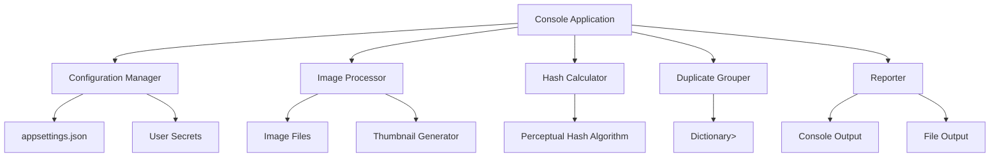

# Image Duplicate Searcher Architecture

## Overview
The Image Duplicate Searcher is a C# console application built on the latest .NET Core that identifies duplicate images by comparing perceptual hashes of generated thumbnails. The application processes images from configured directories, creates small JPEG thumbnails in memory, computes hashes based on image pixels, and groups duplicates for reporting.

## Architecture Diagram

## Components

### Configuration Manager
- Loads settings from `appsettings.json`
- Manages user secrets for sensitive data
- Provides paths to image directories and thumbnail size configuration

### Image Processor
- Scans configured directories for image files (no subfolders)
- Filters supported image formats
- Processes images one by one

### Thumbnail Generator
- Creates in-memory small JPEG thumbnails
- Uses configurable standard size
- Optimizes for fast comparison

### Hash Calculator
- Computes perceptual hash from thumbnail pixels
- Uses image content rather than byte data
- Generates consistent hashes for similar images

### Duplicate Grouper
- Maintains Dictionary<Hash, List<ImageName>>
- Groups images by hash
- Handles hash collisions and additions

### Reporter
- Filters groups with multiple images
- Outputs to console using Spectre.Console
- Saves results to file

## Data Flow
1. Application starts and loads configuration
2. Image Processor scans directories for image files
3. For each image:
   - Generate thumbnail in memory
   - Calculate perceptual hash
   - Add to duplicate groups dictionary
4. After processing all images:
   - Identify groups with multiple images
   - Display results in console
   - Save results to output file

## Technologies and Libraries
- **Framework**: .NET Core (latest version)
- **Console UI**: Spectre.Console (free library)
- **Image Processing**: System.Drawing.Common or ImageSharp (free)
- **Configuration**: Microsoft.Extensions.Configuration
- **Hashing**: Custom perceptual hash implementation

## Configuration
- `appsettings.json`: Image directories, thumbnail size, output file path
- User Secrets: For any sensitive configuration (API keys, etc.)

## Security Considerations
- No external network calls
- User secrets for sensitive data
- File system access limited to configured directories

## Performance Considerations
- In-memory thumbnail processing
- Streaming file reading to avoid loading large images
- Efficient hash computation for fast comparison</content>
<parameter name="filePath">l:\Development\StudioProject\ImageDuplicateSearcher\.spec-workflow\architecture.md