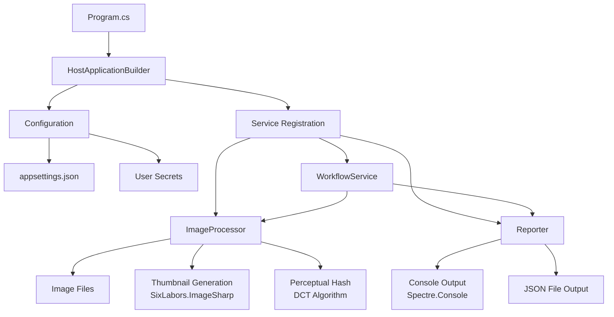

# Image Duplicate Searcher Architecture

## Overview
The Image Duplicate Searcher is a C# console application built on .NET 10 that identifies duplicate images by comparing perceptual hashes of generated thumbnails. The application processes images from configured directories, creates small JPEG thumbnails in memory using SixLabors.ImageSharp, computes perceptual hashes using Discrete Cosine Transform (DCT), groups duplicates, and reports results to the console using Spectre.Console and saves to a JSON file.

## Architecture Diagram

## Components

### Program.cs
- Entry point of the application
- Builds the host using HostApplicationBuilder
- Configures services and runs the WorkflowService

### ServiceConfiguration
- Extension method to configure dependency injection
- Registers WorkflowService, ImageProcessor, and Reporter
- Binds ImageDuplicationOptions from configuration

### WorkflowService
- Orchestrates the main workflow
- Retrieves image list from ImageProcessor
- Processes each image: generates thumbnail, computes hash, groups by hash
- Calls Reporter to output results

### ImageProcessor
- Implements IImageProcessor interface
- Scans configured directory for supported image files
- Generates 32x32 JPEG thumbnails in memory using SixLabors.ImageSharp
- Computes perceptual hash using DCT on grayscale image

### Reporter
- Implements IReporter interface
- Filters duplicate groups (hashes with multiple images)
- Displays results to console using Spectre.Console
- Saves duplicate groups to JSON file

### ImageDuplicationOptions
- Configuration class bound to appsettings.json
- Contains image directory, output file path, and supported formats

### ImageModel
- Simple record holding file path and size for each image

### Desktop App (MAUI) Support
- The application can also run as a desktop GUI using the existing MAUI project. The MAUI template code may be removed and replaced with a minimal UI that invokes the same application services (`WorkflowService`, `ImageProcessor`, `Reporter`).
- The Desktop app hosts the same services and configuration used by the Console app via dependency injection; `MauiProgram.cs` should register the same services as the Console `ServiceConfiguration` extension and bind `ImageDuplicationOptions` from `appsettings.json` or in-memory values supplied by the UI.

### Desktop UI Layout and Behavior
- Purpose: Allow users to run the duplicate-image workflow from a graphical desktop app and view results inline.
- Main elements (single page/window):
    - **Set Image Directory**: Button that opens a folder picker and writes the selected path into a text field labeled `ImageDirectory`.
    - **Set Output File**: Button that opens a save-file dialog and writes the selected path into a text field labeled `OutputFilePath`.
    - **Supported Formats**: Editable text field (single-line) containing comma-separated formats (e.g. `.jpeg,.jpg,.png,.bmp`). This duplicates the `SupportedFormats` section from `appsettings.json` so users can override it at runtime.
    - **Start Scan**: Button that initiates the workflow. When clicked, the UI collects the `ImageDirectory`, `OutputFilePath`, and `SupportedFormats` values, constructs or updates an `ImageDuplicationOptions` instance, and calls into `WorkflowService.ExecuteWorkflow()` (or a new async method designed for UI use) to run the scan.
    - **Response / Log Area**: A multi-line read-only text area (or scrollable control) that receives status updates and final results. The `Reporter` implementation used in the Desktop app should include a UI-aware reporter (e.g., `IReporter` implementation that raises events or provides an `IObservable<string>` of log lines) so the UI can append messages as the workflow runs.

### Integration and Wiring Notes
- Service registration: register `WorkflowService`, `ImageProcessor`, `Reporter` (including a UI-friendly reporter) in `MauiProgram.cs` using the same lifetimes as the Console host. Bind configuration via `ConfigurationBinder` where possible, but allow the UI to override the bound `ImageDuplicationOptions` at runtime.
- Long-running work: Run the workflow on a background thread / task to keep the UI responsive. Expose progress updates via events, callbacks, or an `IProgress<T>` instance passed to the reporter or workflow.
- File pickers: Use MAUI platform dialogs for folder and file picking. On platforms where folder-picking is limited, fall back to selecting the image directory via typed path input.
- Output persistence: When the UI supplies an `OutputFilePath`, the same JSON file-saving logic in `Reporter` can be reused.
- Error handling: Surface errors in the Response area with clear messages and allow retrying.

### Example Minimal XAML Layout (conceptual)
<StackLayout Padding="12">
    <HorizontalStack>
        <Button Text="Set Image Directory" />
        <Entry Placeholder="ImageDirectory" />
    </HorizontalStack>
    <HorizontalStack>
        <Button Text="Set Output File" />
        <Entry Placeholder="OutputFilePath" />
    </HorizontalStack>
    <HorizontalStack>
        <Label Text="Supported Formats" />
        <Entry Placeholder=".jpg,.png,.bmp" />
    </HorizontalStack>
    <Button Text="Start Scan" />
    <ScrollView>
        <Label /> <!-- multiline response area -->
    </ScrollView>
</StackLayout>

### Data Flow (Desktop)
1. User sets `ImageDirectory`, `OutputFilePath`, and `SupportedFormats` via the UI.
2. User clicks `Start Scan`.
3. UI constructs/updates `ImageDuplicationOptions` and starts `WorkflowService.ExecuteWorkflow()` on a background task, passing a UI-aware reporter or progress callback.
4. `ImageProcessor` and hashing logic run unchanged; results are grouped by hash.
5. `Reporter` writes both to the configured `OutputFilePath` and pushes human-readable results to the UI `Response` area.

## Data Flow
1. Application starts in Program.cs, builds host with configuration and services
2. WorkflowService.ExecuteWorkflow() is called
3. ImageProcessor.GetImageList() scans the configured directory for supported image files
4. For each image:
   - ImageProcessor.GenerateThumbnail() creates a 32x32 JPEG thumbnail in memory
   - ImageProcessor.ComputePerceptualHash() calculates DCT-based hash from the thumbnail
   - WorkflowService groups images by hash in a Dictionary<ulong, List<ImageModel>>
5. After processing all images, Reporter.ReportDuplicates() filters groups with duplicates
6. Results are displayed in console and saved to JSON file

## Technologies and Libraries
- **Framework**: .NET 10
- **Image Processing**: SixLabors.ImageSharp (free, cross-platform)
- **Console UI**: Spectre.Console (free library for rich console output)
- **Dependency Injection**: Microsoft.Extensions.DependencyInjection
- **Configuration**: Microsoft.Extensions.Configuration (JSON files and user secrets)
- **Hosting**: Microsoft.Extensions.Hosting

## Configuration
- `appsettings.json`: Contains ImageDuplicationOptions section with image directory, output file path, and supported formats
- User Secrets: For any sensitive configuration (API keys, etc.)

## Security Considerations
- No external network calls
- User secrets for sensitive data
- File system access limited to configured directories

## Performance Considerations
- In-memory thumbnail processing
- Streaming file reading to avoid loading large images
- Efficient hash computation for fast comparison</content>
<parameter name="filePath">l:\Development\StudioProject\ImageDuplicateSearcher\.spec-workflow\architecture.md