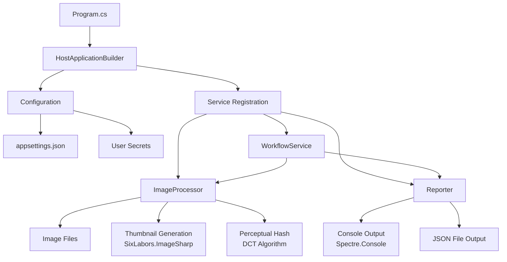
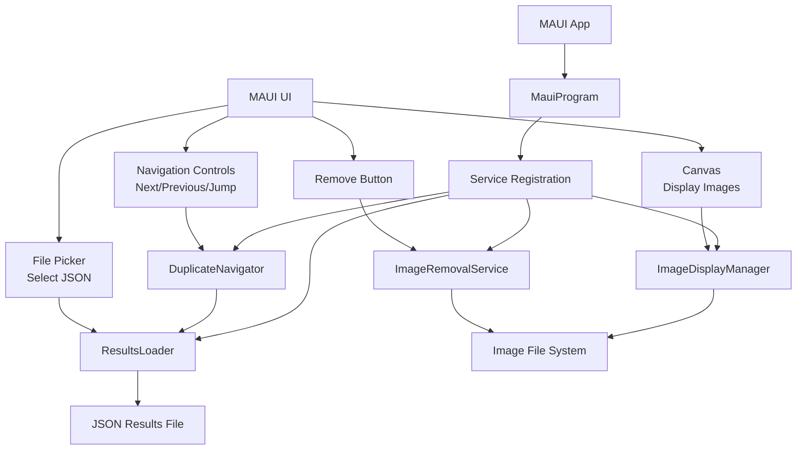

# Image Duplicate Searcher Architecture

## Overview
The Image Duplicate Searcher is a C# console application built on .NET 10 that identifies duplicate images by comparing perceptual hashes of generated thumbnails. The application processes images from configured directories, creates small JPEG thumbnails in memory using SixLabors.ImageSharp, computes perceptual hashes using Discrete Cosine Transform (DCT), groups duplicates, and reports results to the console using Spectre.Console and saves to a JSON file.

## Architecture Diagram

### Console Application Flow

```mermaid
graph TD
    A[Program.cs] --> B[HostApplicationBuilder]
    B --> C[Configuration]
    B --> D[Service Registration]
    
    C --> E[appsettings.json]
    C --> F[User Secrets]
    
    D --> G[WorkflowService]
    D --> H[ImageProcessor]
    D --> I[Reporter]
    
    G --> H
    G --> I
    
    H --> J[Image Files]
    H --> K[Thumbnail Generation<br/>SixLabors.ImageSharp]
    H --> L[Perceptual Hash<br/>DCT Algorithm]
    
    I --> M[Console Output<br/>Spectre.Console]
    I --> N[JSON File Output]
```

### Desktop Application Flow (Android & Windows)

```mermaid
graph TD
    A[MAUI App] --> B[MauiProgram]
    B --> C[Service Registration]
    
    C --> D[ResultsLoader]
    C --> E[DuplicateNavigator]
    C --> F[ImageDisplayManager]
    C --> G[ImageRemovalService]
    
    D --> H[JSON Results File]
    
    E --> D
    F --> I[Image File System]
    G --> I
    
    J[MAUI UI] --> K[File Picker<br/>Select JSON]
    K --> D
    
    J --> L[Canvas<br/>Display Images]
    L --> F
    
    J --> M[Navigation Controls<br/>Next/Previous/Jump]
    M --> E
    
    J --> N[Remove Button]
    N --> G
```

## Components

### Program.cs
- Entry point of the application
- Builds the host using HostApplicationBuilder
- Configures services and runs the WorkflowService

### ServiceConfiguration
- Extension method to configure dependency injection
- Registers WorkflowService, ImageProcessor, and Reporter
- Binds ImageDuplicationOptions from configuration

### WorkflowService
- Orchestrates the main workflow
- Retrieves image list from ImageProcessor
- Processes each image: generates thumbnail, computes hash, groups by hash
- Calls Reporter to output results

### ImageProcessor
- Implements IImageProcessor interface
- Scans configured directory for supported image files
- Generates 32x32 JPEG thumbnails in memory using SixLabors.ImageSharp
- Computes perceptual hash using DCT on grayscale image

### Reporter
- Implements IReporter interface
- Filters duplicate groups (hashes with multiple images)
- Displays results to console using Spectre.Console
- Saves duplicate groups to JSON file

### ImageDuplicationOptions
- Configuration class bound to appsettings.json
- Contains image directory, output file path, and supported formats

### ImageModel
- Simple record holding file path and size for each image

### Desktop App (MAUI) - Results Viewer

**Platforms**: Android, Windows

**Purpose**: Desktop/Mobile GUI for browsing and managing duplicate image search results previously generated by the Console app. The app loads a JSON file containing search results and provides an interactive interface for viewing duplicate groups, navigating between hashes, and removing images.

**Architecture Overview**:
- The Desktop app does NOT run the search/hashing workflow; it interfaces exclusively with pre-generated JSON result files.
- Business logic lives in the Application layer as new services: `ResultsLoader`, `DuplicateNavigator`, `ImageDisplayManager`, and `ImageRemovalService`.
- The MAUI UI layer calls these services to load results, navigate hash groups, render images, and delete files.

### Application Layer Services (Desktop)

#### ResultsLoader (New Interface: IResultsLoader)
- **Purpose**: Parse and load JSON search results.
- **Methods**:
  - `Task<DuplicateSearchResult[]> LoadResultsAsync(string jsonFilePath)` - Loads and deserializes the JSON file
  - `Task<DuplicateSearchResult> GetResultByHashAsync(ulong hash)` - Retrieves specific hash group data
- **Responsibility**: Deserialize JSON and validate structure; throw meaningful exceptions if file is malformed.
- **Model**: Deserializes JSON with structure:
  ```json
  {
    "hash": "123456789",
    "images": [
      { "path": "C:\\folder\\image1.jpg", "sizeMB": 2.5 },
      { "path": "C:\\folder\\image2.jpg", "sizeMB": 2.5 }
    ]
  }
  ```

#### DuplicateNavigator (New Interface: IDuplicateNavigator)
- **Purpose**: Manage navigation state and logic for hash groups.
- **Methods**:
  - `void Initialize(DuplicateSearchResult[] results)` - Set the results collection
  - `int GetTotalGroupCount()` - Return number of hash groups
  - `void GoToGroup(int groupIndex)` - Move to specific group by index
  - `void NextGroup()` - Move to next group
  - `void PreviousGroup()` - Move to previous group
  - `DuplicateSearchResult? GetCurrentGroup()` - Get current hash group data
  - `int GetCurrentGroupIndex()` - Get current position (0-based)
  - `bool CanGoNext()` - Check if next is available
  - `bool CanGoPrevious()` - Check if previous is available
- **Responsibility**: Track current hash group position and validate navigation boundaries.

#### ImageDisplayManager (New Interface: IImageDisplayManager)
- **Purpose**: Handle image rendering in the Canvas; manage placeholder display for missing/corrupted images.
- **Methods**:
  - `Task<ImageSource> GetImageSourceAsync(string imagePath)` - Load image from file path; return placeholder if file missing or corrupted
  - `Task<byte[]> GetImageBytesAsync(string imagePath)` - Load image bytes for rendering
  - `ImageSource GetPlaceholderImage()` - Return placeholder for missing images
  - `bool IsImageAccessible(string imagePath)` - Check if file exists and is readable
- **Responsibility**: Graceful error handling; use placeholder PNG/image resource if image cannot be rendered (file deleted, corrupted, permission denied).
- **Dependencies**: Uses SixLabors.ImageSharp to validate and potentially resize images for display.

#### ImageRemovalService (New Interface: IImageRemovalService)
- **Purpose**: Remove image files from disk based on user action.
- **Methods**:
  - `Task<bool> RemoveImageAsync(string imagePath)` - Delete the image file; return true if success, false if not found/permission denied
  - `Task<(int Successful, int Failed)> RemoveImagesAsync(string[] imagePaths)` - Bulk remove images; return counts
  - `string? ValidateImagePath(string imagePath)` - Check path safety and accessibility; return error message if invalid
- **Responsibility**: Safe file deletion with error handling; validate paths to prevent directory traversal attacks.

### Desktop UI Layout and Behavior

**Single Page with Sections**:

1. **Results File Section**
   - Label: "Search Results File"
   - Button: "Open JSON Results" → Opens file picker (FilePicker API) to select a JSON file
   - Text display (read-only): Shows selected file path
   - Refreshes automatically when file is loaded

2. **Summary Section** (After file is loaded)
   - Label: "Total Duplicate Groups: X" (e.g., "Total Duplicate Groups: 25")
   - Dynamically updates when results are loaded

3. **Navigation Section**
   - Label: "Current Group: X / Y" (e.g., "Current Group: 3 / 25")
   - Button: "Previous" (disabled if on first group)
   - Button: "Next" (disabled if on last group)
   - Entry/Input field labeled "Jump to Group #" with text input and "Go" button
   - Updates dynamically as user navigates

4. **Hash Information Display**
   - Label: "Hash: [current hash value]" (read-only)
   - Label: "Images in Group: N" (count of images in current group)

5. **Image Canvas Display Area**
   - Grid/Collection layout showing thumbnail images of all images in the current hash group
   - Each image thumbnail shows:
     - Image rendered from file (or **placeholder** if unavailable)
     - File path below thumbnail
     - File size (sizeMB) below path
     - "Remove" button below size
   - Images are laid out in a responsive grid (2-4 columns depending on screen size and platform)
   - Scrollable if more images than fit on screen
   - **Placeholder rendering**: If image file is missing, corrupted, or inaccessible, display a standard placeholder image/icon instead of crashing or leaving blank space

6. **Error/Status Area** (Optional footer)
   - Messages for errors (e.g., "File not found", "Invalid JSON format", "Permission denied when deleting image")
   - Temporary status updates (e.g., "Image removed successfully")

### Integration and Wiring Notes (Desktop)

- **Service Registration in MauiProgram.cs**:
  - Register `IResultsLoader` as Singleton
  - Register `IDuplicateNavigator` as Singleton
  - Register `IImageDisplayManager` as Singleton
  - Register `IImageRemovalService` as Singleton
  - Do NOT register `WorkflowService`, `ImageProcessor`, or `Reporter` in the Desktop app (search logic is not used)

- **Platform Support**:
  - **Windows**: Full support; use Windows file picker APIs via MAUI FilePicker
  - **Android**: Full support; use Android scoped storage + MAUI FilePicker with appropriate permissions in `AndroidManifest.xml`

- **Permissions**:
  - Windows: No special permissions needed (user filesystem access)
  - Android: `READ_EXTERNAL_STORAGE` and `WRITE_EXTERNAL_STORAGE` (or scoped storage API for newer Android versions)

- **Image Loading & Rendering**:
  - Use MAUI `Image` control with `ImageSource` bound to `IImageDisplayManager`
  - Set `Aspect` to `AspectFill` or `AspectFit` for uniform thumbnail display
  - Cache loaded images in memory to reduce repeated file I/O
  - On deletion, refresh the current group view to remove the image from the UI

- **Error Handling**:
  - Wrap file operations in try-catch; display user-friendly error messages in the UI
  - Image file deletion: Catch `UnauthorizedAccessException`, `FileNotFoundException`, `IOException`; show message to user (e.g., "Cannot delete: file may be in use or permission denied")
  - JSON loading: Validate structure and report malformed files

- **Background Tasks**:
  - Image loading and deletion should run on background threads to keep UI responsive
  - Use `Task.Run()` or `MainThread.InvokeOnMainThreadAsync()` for cross-thread UI updates

## Data Flow

### Console Application
1. Application starts in Program.cs, builds host with configuration and services
2. WorkflowService.ExecuteWorkflow() is called
3. ImageProcessor.GetImageList() scans the configured directory for supported image files
4. For each image:
   - ImageProcessor.GenerateThumbnail() creates a 32x32 JPEG thumbnail in memory
   - ImageProcessor.ComputePerceptualHash() calculates DCT-based hash from the thumbnail
   - WorkflowService groups images by hash in a Dictionary<ulong, List<ImageModel>>
5. After processing all images, Reporter.ReportDuplicates() filters groups with duplicates
6. Results are displayed in console and saved to JSON file

### Desktop Application (Result Browser)
1. MAUI app starts; MauiProgram registers Desktop services (ResultsLoader, DuplicateNavigator, ImageDisplayManager, ImageRemovalService)
2. User clicks "Open JSON Results" button
3. File picker opens; user selects a JSON results file from a previous Console search
4. ResultsLoader.LoadResultsAsync() deserializes the JSON and validates structure
5. DuplicateNavigator.Initialize() receives the results array and resets position to group 0
6. UI updates: summary shows total group count, current group display shows hash and image count
7. ImageDisplayManager loads image sources for all images in current group
8. Canvas renders thumbnails with file paths and sizes; failed images show placeholder
9. User navigates:
   - **Next/Previous buttons**: DuplicateNavigator moves position and UI refreshes images
   - **Jump field**: DuplicateNavigator moves to specified index with validation
10. User clicks "Remove" on image:
    - ImageRemovalService.RemoveImageAsync() deletes file from disk
    - On success, current group's image list is updated and canvas refreshes
    - On failure, error message is shown to user

## Technologies and Libraries

### Console Application
- **Framework**: .NET 10
- **Image Processing**: SixLabors.ImageSharp (free, cross-platform)
- **Console UI**: Spectre.Console (free library for rich console output)
- **Dependency Injection**: Microsoft.Extensions.DependencyInjection
- **Configuration**: Microsoft.Extensions.Configuration (JSON files and user secrets)
- **Hosting**: Microsoft.Extensions.Hosting

### Desktop Application (MAUI)
- **Framework**: .NET 10 / MAUI
- **UI Framework**: MAUI (cross-platform desktop/mobile UI)
- **Image Rendering**: MAUI Image control with SixLabors.ImageSharp for validation
- **File Access**: MAUI FilePicker, platform-specific file APIs
- **Dependency Injection**: Microsoft.Extensions.DependencyInjection
- **Serialization**: System.Text.Json (for JSON deserialization)

## Configuration
- `appsettings.json`: Contains ImageDuplicationOptions section with image directory, output file path, and supported formats
- User Secrets: For any sensitive configuration (API keys, etc.)

## Security Considerations
- No external network calls
- User secrets for sensitive data
- File system access limited to configured directories

## Performance Considerations
- In-memory thumbnail processing
- Streaming file reading to avoid loading large images
- Efficient hash computation for fast comparison</content>
<parameter name="filePath">l:\Development\StudioProject\ImageDuplicateSearcher\.spec-workflow\architecture.md